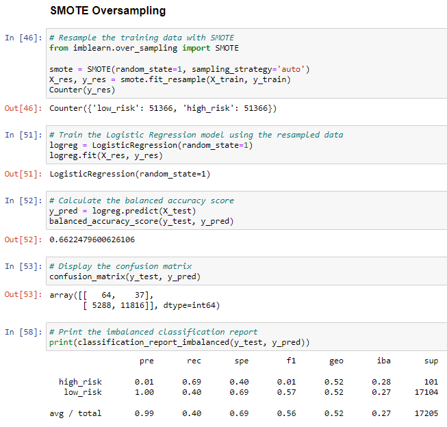
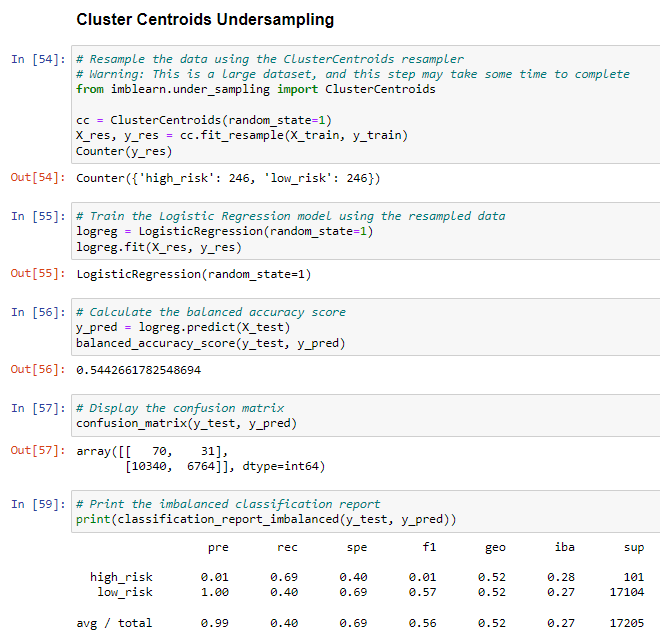
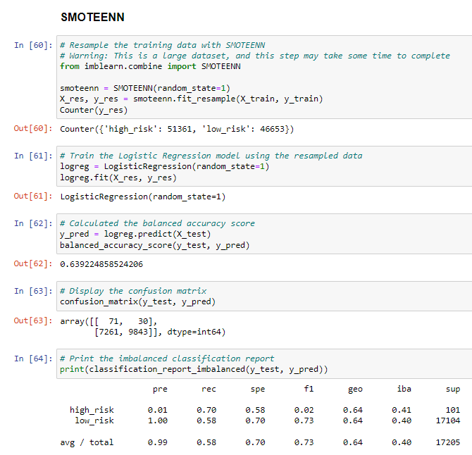
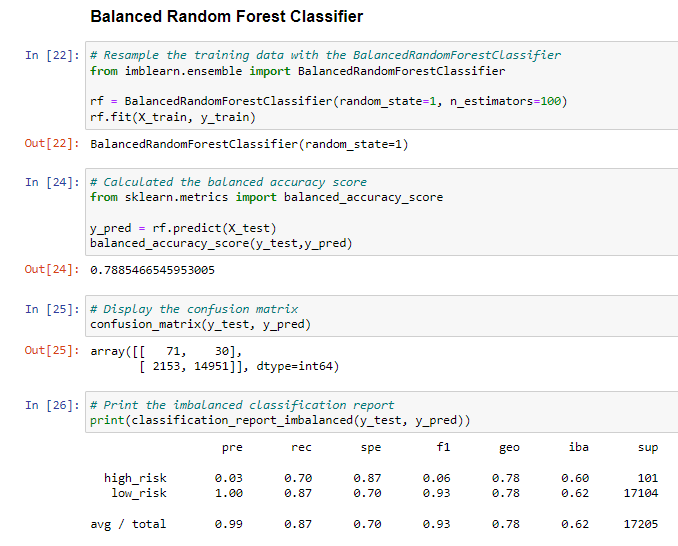
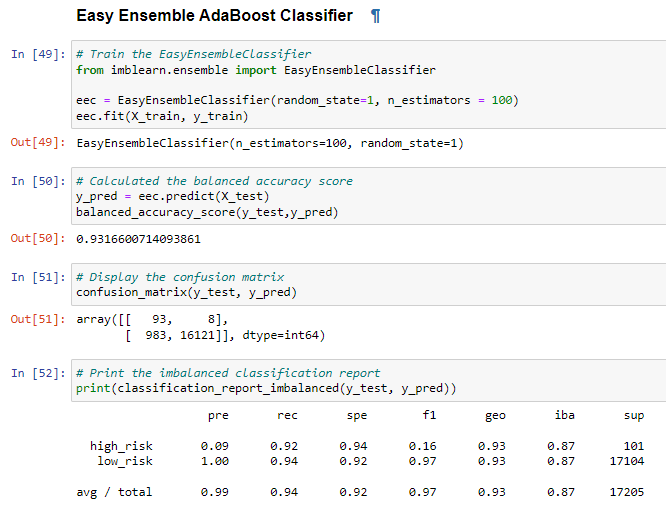

# Credit_Risk_Analysis

## **Overview**
This project constitutes a comparative assesment of various machine learning techniques and their relative utilities for the purpose of assessing credit card loan risk based on a historical dataset provided by a fictional peer-to-peer lending service.

### **Purpose**
The algorithms designed and deployed for this project were selected on the premise that credit risk as a statistical problem entails a notable degree of 'unbalanced classification', i.e., a data landscape wherein non-risky loans are assumed to significantly outnumber risky loans.  Being necessarily trained on unbalanced classes, the models employed for this project were therefore specificially chosen so as to best compensate for such imbalances so that they might provide the company with an accuarate predictive model of the risks involved in granting future credit loans.

--------------------------------
## Results
To prepare the dataset for analysis, it was loaded into a dataframe using Pandas and cleaned.  The cleaned data was split into training and testing sets, string values were converted into numerical representations, and target variables were identified.    

The results of the subsequent comparative analyses were as follow:

### **1) Oversampling Techniques**
- RandomOverSampler
The RandomOverSampler algorithm operates according to a 'naive' principle whereby the unbalanced distrubition between majority and minority classifications is resolved by randomly sampling minority datapoints for incorporation into the training dataset until equilibrium is reached.

- SMOTE
The SMOTE (Synthetic Minority Oversampling TEchnique) algorithm accomplishes the same goal as the RandomOverSampler using a slightly more sophisticated method.  Where the RandomOverSampler simply reclassifies existing minority datapoints, SMOTE plausibly interpolates new synthetic datapoints collinear with existing training data and incorporates them into the majority set.

   

### **2) Undersampling Technique**
- ClusterCentroids
The ClusterCentroids algorithm is an undersampling technique which accomplishes equilibrium between the majority and minority data by reducing the majority set to the size of the minority.  This process is based on the identification of 'clusters' or centroids within the majority dataspace, which are reduced down to their best representational datapoints, thus effectvely reducing the size of the overall majority set with minimal loss of information.     

### **3) Combintation Over-Undersampling Technique**
- SMOTEENN
The SMOTEENN (SMOTE + Edited Nearest Neighbor) algorithm combines SMOTE with the ENN technique.  Edited Nearest Neighbor works by finding the K-nearest neighbor for each datapoint and checking for a classification discrepancy, in which case both the datapoint and its neighbor are removed from the dataset.  The SMOTEENN technique combines the class-agnostic undersampling ability of ENN with the synthetic-interpolative ability of SMOTE such that each new datapoint synthesized by SMOTE is subsequently filtered for valdity through the ENN process.  

### 4) **Ensemble Techniques**
- BalancedRandomForestClassifier
The BalancedRandomForestClassifer algorithm employs a forest classifier that uses random undersampling to serially structure the data into increasingly tighter branches based on class assignment.  

- EasyEnsembleClassifier
The EasyEnsembleClassifier also uses random undersampling in conjuction with an ensemble of preexisting "AdaBoost" algorithms trained on balanced sample sets.

--------------------------------

## **Summary**
 

### Recommendation for Alternative Model
After some additional exploration, including experimentation with increased epoch lengths for the model training period, it appears that the implementation of a random forest classifier would potentially increase the accuracy of the desired predictions for this dataset.  This is because, as was observed when the training period epochs were doubled or even tripled without any significant increase in accuracy, the risk of overfitting for this dataset seems low.  That makes it a possibly ideal fit for random forest classification, which takes advantage of multiple decision trees as a means of resolving issues with accurate classification. 
