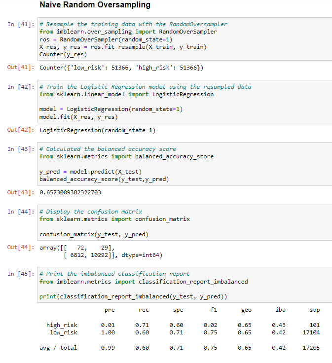

# Credit_Risk_Analysis

## **Overview**
This project constitutes a comparative assesment of various machine learning techniques and their relative utilities for the purpose of assessing credit card loan risk based on a historical dataset provided by a fictional peer-to-peer lending service.

### **Purpose**
The algorithms designed and deployed for this project were selected on the premise that credit risk as a statistical problem entails a notable degree of 'unbalanced classification', i.e., a data landscape wherein non-risky loans are assumed to significantly outnumber risky loans.  Being necessarily trained on unbalanced classes, the models employed for this project were therefore specificially chosen so as to best compensate for such imbalances so that they might provide the company with an accuarate predictive model of the risks involved in granting future credit loans.

--------------------------------
## Results
To prepare the dataset for analysis, it was loaded into a dataframe using Pandas and cleaned.  The cleaned data was split into training and testing sets, string values were converted into numerical representations, and target variables were identified.    

The results of the subsequent comparative analyses were as follow:

### **1) Oversampling Techniques**
- RandomOverSampler

The RandomOverSampler algorithm operates according to a 'naive' principle whereby the unbalanced distrubition between majority and minority classifications is resolved by randomly sampling minority datapoints for incorporation into the training dataset until equilibrium is reached.

- SMOTE

The SMOTE (Synthetic Minority Oversampling TEchnique) algorithm accomplishes the same goal as the RandomOverSampler using a slightly more sophisticated method.  Where the RandomOverSampler simply reclassifies existing minority datapoints, SMOTE plausibly interpolates new synthetic datapoints collinear with existing training data and incorporates them into the majority set.

   

### **2) Undersampling Technique**
- ClusterCentroids

The ClusterCentroids algorithm is an undersampling technique which accomplishes equilibrium between the majority and minority data by reducing the majority set to the size of the minority.  This process is based on the identification of 'clusters' or centroids within the majority dataspace, which are reduced down to their best representational datapoints, thus effectvely reducing the size of the overall majority set with minimal loss of information.     

### **3) Combintation Over-Undersampling Technique**
- SMOTEENN

The SMOTEENN (SMOTE + Edited Nearest Neighbor) algorithm combines SMOTE with the ENN technique.  Edited Nearest Neighbor works by finding the K-nearest neighbor for each datapoint and checking for a classification discrepancy, in which case both the datapoint and its neighbor are removed from the dataset.  The SMOTEENN technique combines the class-agnostic undersampling ability of ENN with the synthetic-interpolative ability of SMOTE such that each new datapoint synthesized by SMOTE is subsequently filtered for valdity through the ENN process.  

### 4) **Ensemble Techniques**
- BalancedRandomForestClassifier

The BalancedRandomForestClassifer algorithm employs a forest classifier that uses random undersampling to serially structure the data into increasingly tighter branches based on class assignment.  

- EasyEnsembleClassifier

The EasyEnsembleClassifier also uses random undersampling in conjuction with an ensemble of preexisting "AdaBoost" algorithms trained on balanced sample sets.

--------------------------------

## **Summary**
The results of this project's data analysis are hereby summarized:

- Native Random Oversampling:
  - Balanced Accuracy Score = 0.6573009382322703
  - Avg/Total F1 = 0.75

- SMOTE Oversampling:
  - Balanced Accuracy Score = 0.6622479600626106
  - Avg/Total F1 = 0.56      

- Cluster Centroid Undersampling:
  - Balanced Accuracy Score = 0.5442661782548694
  - Avg/Total F1 = 0.56  

- SMOTEENN Combination Sampling:
  - Balanced Accuracy Score = 0.639224858524206
  - Avg/Total F1 = 0.73 

- Balanced Random Forest Classifier:
  - Balanced Accuracy Score = 0.7885466545953005
  - Avg/Total F1 = 0.93  

- Easy Ensemble AdaBoost Classifier:
  - Balanced Accuracy Score = 0.9316600714093861
  - Avg/Total F1 = 0.97

[NOTE: "F1" is a compound variable which combines the Precision and Recall values of a model]

### Recommendation for Best Suited Model
Judging purely based on the Balanced Accuracy and F1 scores produced for each model, it would appear that the Easy Ensemble AdaBoost Classifier represents the most suitable option for the task.  However, it is necessary to also consider the nature of the data and task itself and the significance of these measurements in that context.  It should be noted that every model performed poorly across all measures when predicting high risk results, which are the major concern for the company in this case.  Additionally, while Precision and Accuracy scores are certainly still relevant, the most strictly significant measure in the case of this project would be Recall -- the measure of a model's ability to return complete predictions, i.e. minimum false negatives.  This is because the importance of correctly identifying possible risky credit loans is greater than other measures of success which are less likely to result in catastrophic consequences if not optimized for.  

In conclusion, the Easy Ensemble AdaBoost Classifier remains the most optimal model out of all the models tested for the task of predicting credit loan risk, specifically because of its significantly higher Recall measure (0.92) regarding the classification of high risk datapoints.
